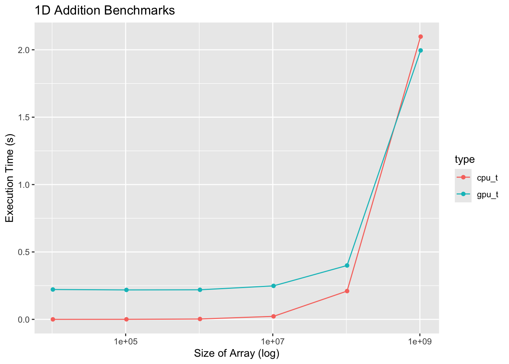

Usage
=====

.. include:: examples/add.cu
   :language: c++

Keep in mind that CUDA operates tasks in a thread bundle known as warps. For a single addition operation on a matrix, CUDA will initiate 32 threads.

Be aware that you cannot use sizeof() or A.size() for a std::vector A within CUDA functions. CUDA lacks the ability to determine the length of an array, meaning it doesn't know the number of computations to parallelize. Therefore, you must supply the number of operations or the size of the input arrays required for the computation as a parameter. In the add_1d_kernel example above, the size of the arrays is provided as a parameter n. 

Benchmarks 
=====

GPU has a very slow latency but it compensates its slow latency by large throughput. For the example above, GPU shines when you are working with an array size of 

